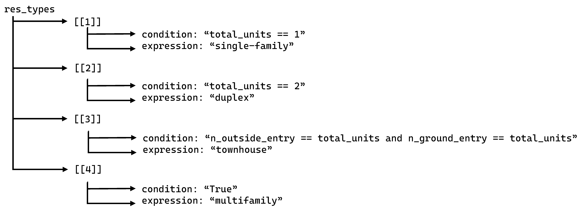

# Open Zoning Feed Specification

The Open Zoning Feed Specification (OZFS) is offered as a scalable,
extensible data schema for encoding residential zoning regulations at
the parcel level in a way that is both machine-readable and
jurisdiction-agnostic. OZFS is implemented in GeoJSON, a geographic
extension of JSON that retains JSON’s nested flexibility. OZFS departs
from legacy tabular formats by storing only those variables actually
defined in a district and permitting new key–value pairs without
changing the underlying schema.

OZFS makes six specific contributions:

1.  Non-tabular structure. A hierarchical JSON model represents
    districts and optional constraints, eliminating
    column inflation and redundant data entry.

2.  Jurisdiction-specific definitions. Each feed contains an explicit
    glossary for locally defined terms—e.g., townhouse, multifamily,
    building height—so that uniform semantics are not imposed.

3.  Python-syntax mathematical expressions. Controls may be stored as
    formulas (`MaxHeight` = 0.5 \* `LotDepth`), allowing rules that
    reference parcel or building attributes.

4.  Variable-referencing mechanism. Constraints can point to other
    variables in the same feed, supporting compound rules and one-time
    entry of shared values.

5.  Embedded conditional logic. The schema accommodates
    context-dependent provisions
    (`if BuildingSetback ≥ 15 then MaxHeight = 35 else 30`) that
    spreadsheets cannot capture consistently.

6.  Standards for describing parcels and buildings. While previous
    efforts have focused on encoding characteristics of zoning
    regulations, we argue that the usefulness of that data depends on
    the interactions among characteristics of individual parcels and
    proposed buildings. OZFS includes rules for consistently encoding
    information about regulations, buildings, and parcels.

# OZFS Data Structures

The OZFS data standard includes three files types:

-   a file with a \*.zoning extension to describe the zoning regulations
    for a particular municipality;

-   a file with a \*.parcel extension to describe the geometry of all
    parcels (or all parcels of interest) within a municipality; and

-   a file with a \*.building extension to describe the geometry of a
    proposed building.

## Zoning regulations

Zoning data are encoded in a separate \*.zoning file for each
municipality. The \*.zoning file is formatted as a geojson file, which
offers the advantages of a nested data structure. The specific structure
of the \*.zoning file is illustrated is illustrated in outline form
below.

-   `[filename.zoning]`

    -   `Type: "FeatureCollection"`

    -   `version: "0.5.0"`

    -   `muni_name:` (required)

    -   `date:` (required)

    -   `definitions:` (required) *(structured array, see further detail
        below)*

    -   `features:` (required) *(structured array, see further detail
        below)*

The top level of the file is an array with six key-value pairs:

-   `Type`: As for geojson files, the value for this key should be
    “FeatureCollection.”

-   `version`: The version of the OZFS data standard used in this file.
    The current version of the standard is 0.5.0.

-   `muni_name`: The name of the municipality this zoning code refers
    to. This is a required value.

-   `date`: The most recent date on which the zoning regulations are
    known to have been in effect. This is a required value.

-   `definitions` is an array of definitions of terms (in the current
    version of the standard, height and residential building types) that
    may very from one municipality to the next and are defined in the
    text of the zoning code. These are defined in a structured array
    described in greater detail below.

-   `features` contains information on each zoning district. As for
    definitions, these are defined in a structured array described in
    greater detail below.

The features array, which describes each zoning district, and the
definitions array, which contains municipality-specific definitions of
terms, are described in greater detail below.

### District-level information in the features array

The features array represents each district by an array of three
elements: `type`, `properties`, and `geometry`. As for geojson files,
the value for the `type` key will be “Feature” and the geometry key
takes an array of coordinates describing the geometry of the feature (in
this case, the district boundary). The structure of the features array
is illustrated in outline form below.

-   `features`

    -   `[[1]]`

        -   `type: "Feature"`

        -   `properties`

            -   `dist_name:` (optional)

            -   `dist_abbr:` (required)

            -   `planned_dev:` (optional)

            -   `overlay:` (optional)

            -   `res_types_allowed:` (conditionally required)

            -   `constraints`

        -   `geometry`

    -   `...`

    -   `[[n]]`

        -   `type: "Feature"`

        -   `properties`

        -   `geometry`

The value for the `properties` key is a list of key-value pairs that may
include the following:

-   `dist_name` is the name of district. This value is optional.

-   `dist_abbr` is the abbreviated name of district. This value is
    required.

-   `planned_dev` is a binary value indicating whether this is a planned
    development district (where the entire district will be developed by
    a single developer who negotiates constraints directly with the
    municipality). This value is optional and is assumed to have a value
    of false if it is missing.

-   `overlay` indicates whether this district is an overlay district (a
    district that modifies the requirements of any base districts it
    overlaps) and (optionally) how the overlay district regulations
    relate to those of the overlapping base district(s). This value is
    optional and should only be present for overlay districts. In
    overlay districts, the value of the overlay key should be one of the
    following:

    -   `"TRUE"` indicates that it is an overlay district and that no
        other information is available (the data standard does not
        require complete information on overlay districts).

    -   `"restrict"` indicates that the overlay district further
        restricts the requirements of the base district. In other words,
        when there is a conflict between the requirements of the base
        district and the requirements of the overlay district, the more
        restrictive of the two requirements applies.

    -   `"relax"` indicates that the overlay district relaxes the
        requirements of the base district: when there is a conflict
        between the requirements of the base district and the
        requirements of the overlay district, the less restrictive of
        the two requirements applies.

    -   `"replace"` indicates that the requirements of the overlay
        district replace those of the base districts. In other words,
        when there is a conflict between the requirements of the overlay
        district and the base district, the requirements of other
        overlay district applies (regardless of whether they relax or
        restrict the requirements of the base district).

    -   `"no_residential_effect"` indicates that the overlay district
        would have no effect on residential developments. As an example,
        Dallas has overlay districts that prohibit the sale of alcohol,
        but are not relevant to the question of siting multifamily
        housing.

    -   `"demolition_only"` indicates that the overlay district places
        restrictions on what can be demolished, but not on what can be
        built. Historic preservation districts may fall into this
        category.

    -   `"none-by-right"` indicates that any development within the
        overlay district requires discretionary approval. These are
        often (but not always) planned development overlay districts.

-   `res_types_allowed` is a list of residential land uses that are
    allowed in the district. All values in the list must also appear in
    the `definitions` array. If this list of values is missing for a
    base district, it is assumed that no residential uses are allowed by
    right in the district.

-   `constraints` is an array of constraints that define allowable
    building characteristics. The `constraints` is not necessary for
    planned development districts or for overlay districts that have a
    value other than “relax”, “restrict”, or “replace” for the overlay
    key.

Constraints are described by numeric values or expressions (in Python
syntax) and are stored in the structure illustrated below in outline
form.

-   `constraints`

    -   `[[constraint name 1]]`

        -   `min_val (conditionally required)`

            -   `[[1]]`

                -   `expression: (required)`

                -   `condition: (conditionally required)`

                -   `min_max: (conditionally required)`

            -   `...`

            -   `[[n]]`

        -   `max_val (conditionally required)`

            -   `[[1]]`

                -   `expression: (required)`

                -   `condition: (conditionally required)`

                -   `min_max: (conditionally required)`

            -   `...`

            -   `[[n]]`

    -   `...`

    -   `[[constraint name n]]`

Possible constraint names include:

-   `setback_front`: The front setback, in units of feet

-   `far`: The floor area ratio

-   `setback_side_int`: The interior side setback, in units of feet

-   `setback_side_ext`: The exterior side setback (for corner lots) in
    units of feet

-   `lot_cov_bldg`: the percentage of the lot area covered by buildings,
    expressed as whole-number percentage points.

`setback_front` (the front setback), `far` (the floor area ratio), and
`lot_cov_bldg` (the lot coverage). [Appendix
A](https://vibe-lab-gsd.github.io/ozfs-standard/appendices/appendix-a.html)
includes a complete list of constraints that have been defined for the
\*.zoning file, together with their descriptions. For each constraint
that is included in the constraints array, a minimum value `min_val`
and/or a maximum value `max_val` must be given.

Minimum and maximum values for constraints are stored as arrays
including the following key-value pairs:

-   `condition`: The condition under which the minimum or maximum value
    applies. This key is required if there is more than one element in
    the min_value (or max_value) array. The condition can be a logical
    expression (in Python syntax) defining the condition under which the
    minimum (or maximum) value applies. Some of the variables that may
    be use in constraint and condition expressions are:

    -   `lot_width`: The width of the parcel, in feet.

    -   `lot_area`: The area of the parcel, in acres.

    -   `height`: The building height, in feet.

    [Appendix
    B](https://vibe-lab-gsd.github.io/ozfs-standard/appendices/appendix-b.html)
    includes a full list of the of the variables that can be used in
    constraint and condition expressions, along with a description of
    each variable. If the condition under which the value applies cannot
    be described as a logical expression (one that evaluates to True or
    False) with one or more of those variables, it may be described in a
    text string (which will limit machine-readability).

-   `expression`: These can either be constant numeric values or
    equations (in Python syntax) referring to variables listed in
    [Appendix
    B](https://vibe-lab-gsd.github.io/ozfs-standard/appendices/appendix-b.html).
    This can be a list of multiple values or expressions, in which case
    the `min_max` key should be used to specify whether the minimum or
    maximum value in the list should be used. If the value of the
    `condition` key is a text string that is not a logical expression,
    the value of the `expression` key may be a list of numbers (where
    the text string will describe the circumstances in which each number
    applies).

-   `min_max`: This key is required if the list of expressions has a
    more than one element in it and `condition` is a logical expression
    (rather than just a free-form text string). It is a character string
    that can take one of two values: `min` or `max`. A value of `min`
    indicates that the governing constraint is the minimum of the
    possible values listed in the `expression` key. A value of `maximum`
    indicates that the governing constraint is the maximum of the
    possible values listed in the `expression` key.

The four examples below illustrate how zoning code text can be stored in
the \*.zoning file.

**Example 1: A single constraint value.** In Dallas, the minimum is side
setback is specified for agricultural districts as follows:

> *Minimum side yard is 20 feet.* (City of Dallas 2024)

This requirement could be added to the constraints array in the
\*.zoning file as follows:

-   `constraints`

    -   `setback_side_int`

        -   `min_val`

            -   `[[1]]`

                -   `expression: "20"`

**Example 2: Using min_max field.** For the Cockrell Hill Single-Family
District, the minimum side setback depends on the length of the front
footage.

> *No structure shall be closer to a side or rear lot line than five
> feet or a distance equal to 10% of the front footage of the lot,
> whichever distance shall be greater* (City of Cockrell Hill 2010, 13)

This requires a list of expressions for the minimum side and rear
setbacks where the selected value should be the greater of the result of
the two expressions. This requirement could be added to the constraints
array in the \*.zoning file as follows:

-   `constraints`

    -   `setback_side_int`

        -   `min_val`

            -   `[[1]]`

                -   `expression: [ "5", "0.1 * lot_width" ]`

                -   `min_max: "max"`

**Example 3: Multiple conditions.** **?@fig-const-ex-3** from the Fort
Worth Zoning Ordinance (City of Fort Worth, Texas 2007) shows how a
district’s setback requirements are recorded when the value depends on
the building height.

> *The height of a building in the “A” through “F” districts may be
> increased when the front, side and rear yard dimensions are each
> increased above the minimum requirements by one foot for each foot
> such building exceeds the height limit of the district in which it is
> located.*

This requirement could be added to the constraints array in the
\*.zoning file as follows:

-   `constraints`

    -   `setback_side_int`

        -   `min_val`

            -   `[[1]]`

                -   `condition: "height <= 35"`

                -   `expression: "25"`

            -   `[[2]]`

                -   `condition: "height > 35"`

                -   `expression: "25 + (height - 35)"`

**Example 4: Complex conditions.** The setback requirments for the Urban
Center District in Addison, Texas (Town of Addison, Texas 2024) are:

NOTE: Addison’s code has since been updated. Either update this example,
or find a new example.

> *The build-to line for primary buildings, structures, walls and fences
> shall be ten feet on all public street frontages except along
> residential streets (category C) and residential mew streets (category
> D), which shall have build-to lines as established later in this
> section. Up to 25 percent of any street frontage of a building may
> vary from this build-to line, but shall not be less than five feet,
> nor more than 25 feet.*
>
> *The build-to line for residential streets (category C) shall be five
> feet where a building or structure fronts public open space. In all
> other cases along residential streets, a maximum of 75 percent of any
> block face may be constructed to the five-foot build-to line with the
> remainder of the block face being constructed no closer than eight
> feet, nor more than 25 feet from the R.O.W.*
>
> *The build-to line for residential mew streets (category D) shall be
> contiguous with the R.O.W. A minimum of 70 percent of the build-to
> line of any block or parcel must be occupied by buildings or parking
> structures.*

Location-based conditions can be addressed through the creation of
implied overlay districts.

Since residential street categories are not defined in the \*.zoning
file, these requirements cannot be stored in a way that would be
directly interprered by software. However, the data standard still
allows these requirements to be recorded, so software could return a
note on the potential ambiguity. The current version of the \*.bldg file
does store information on the building’s orientation with respect to the
street, so While a software algorithm may not be able to interpret
complex conditions like those listed for the Urban Center District in
Addison , they can still be stored in the \*.zoning file as shown in
**?@fig-const-ex-4**. Note that the setback exceptions for parts of the
block face were not encoded.

This requirement could be added to the constraints array in the
\*.zoning file as follows:

-   `features`

    -   `[[1]]`

        -   `type: "Feature"`

        -   `properties`

            -   `dist_abbr: "UC"`

            -   `res_types_allowed:`

-   `constraints`

    -   `setback_front`

        -   `min_val`

            -   `[[1]]`

                -   `condition: ["Along a a residential mew street (category D)", "70 percent of build-to line occupied by structures"]`
                -   `expression: "0"`

            -   `[[2]]`

                -   `condition: ["Along a residential street (category C)", "Building fronts public open space"]`

                -   `expression: "5"`

            -   `[[3]]`

                -   `condition: "Along a residential street (category C)"`

                -   `expression: "8"`

            -   `[[4]]`

                -   `condition: "Along all other public streets"`

                -   `expression: "10"`

        -   `max_val`

            -   

    -   `front_vary_portion`

        -   `max_val`

            -   `[[3]]`

                -   `condition: "Along all other public streets"`

                -   `expression: "25"`

    -   `front_vary_range`

        -   `min_val`

            -   `[[3]]`

                -   `condition: "Along all other public streets"`

                -   `expression: "5"`

        -   `max_val`

            -   `[[3]]`

                -   `condition: "Along all other public streets"`

                -   `expression: "25"`

### Definitions

There may be terms that are used in many different zoning codes, but
with definitions that vary across municipalities. The current version of
the OZFS standard (version 0.5.0) requires definitions for height and
for types of residential buildings. Other definitions may be added to
future extensions of the standard.

-   `definitions`
    -   `height`
        -   `[[1]]`
            -   `condition:`
            -   `expression:`
        -   `...`

        -   `[[n]]`

    -   `res_type`

        -   `[[1]]`

            -   `condition`

            -   `expression`

        -   `...`

        -   `[[n]]`

For each definition, one or more arrays comprising conditions and
expressions can be defined. The value of the `condition` key defines the
circumstance under which the value of the `expression` key applies and
should be a logical statement (one that returns a value of true or
false) in Python syntax, referencing any of the variable names listed in
[Appendix
B](https://vibe-lab-gsd.github.io/ozfs-standard/appendices/appendix-b.html).
The value of the `expression` key should be an equation (in Python
syntax) referencing any of the variable names listed in [Appendix
B](https://vibe-lab-gsd.github.io/ozfs-standard/appendices/appendix-b.html).
As an example, if the height of a building is defined as the top of the
highest wall plate for buildings with a flat roof type and the mid-point
between the top of the roof and the eave for all roof types except a
flat roof (see [Appendix
C](https://vibe-lab-gsd.github.io/ozfs-standard/appendices/appendix-c.html)
for an illustration of various roof types), the height definition would
be coded as illustrated below

-   `height`
    -   `[[1]]`
        -   `condition: "roof_type == 'flat'"`
        -   `expression: "height_plate"`
    -   `[[2]]`
        -   `condition: "roof_type != 'flat'"`
        -   `expression: "(height_top + heigth_eave) / 2"`

Conditions do not necessarily need to be mutually exclusive. When they
are not, they are applied in the order in which they appear. For
example, if the residential building type (`res_type`) of a building
with three or more units is defined as `multifamily` building unless all
units have outside entrances on the ground level, in which case it is
defined as a `townhouse`, this could be encoded as shown below. 

In that
example, all buildings with only one dwelling unit would be defined as
single-family. Of the remaining buildings, all buildings with two units
would be defined as duplexes. Of the remaining buildings (all of which
would have three or more dwelling units), those in which all units have
an outside, ground-level entrances would be classified as townhouses,
and all other buildings with three or more units would be classified as
multifamily buildings.

## Parcel geometry

Parcel geometry data representing parcel boundaries as polygons are
commonly available in GIS files from state, county, or municipal
open-data portals. These require pre-processing for zoning analysis
because applying required setbacks to determine the buildable area of a
parcel requires information not only about the shape and location of the
parcel, but also about its orientation with respect to the street, since
zoning codes may specify difference setbacks for the front, sides, and
rear of a parcel, respectively.

In the OZFS data standard, parcels must be represented in a geojson file
that includes, for each parcel, line strings representing each parcel
edge (front, back, and side(s) and a point representing the parcel
centroid. All features have a `parcel_id` key with a value that uniquely
identifies which parcel each edge or centroid is associated with.

Each feature in the parcel dataset will also have a key, `side` , that
can take one of six values:

-   `front` indicates that this is a line string representing the front
    of a parcel.
-   `rear` indicates that this is line string representing the rear of a
    parcel.
-   `interior side` indicates that this is a line string representing
    the interior side of a parcel (the side adjacent to another parcel).
-   `exterior side` indicates that this is a line string representing
    the exterior side of a parcel. Only a corner lot can have an
    exterior side. This is the side of a corner lot that is adjacent
    (and approximately parallel) to the street that is not indicated in
    the parcel’s address.
-   `unknown` indicates that this is a line string representing the side
    of a parcel that has not been classified into one of the above
    categories (for irregular parcel geometries and/or parcels where the
    relationship to the adjacent street network is unclear).
-   `centroid` indicates that this is a point representing the parcel’s
    centroid.

Parcel centroids have four additional key/value pairs:

-   `lot_width` indicates the width of the parcel in feet.

-   `lot_depth` indicates the depth of the parcel in feet.

-   `lot_area` indicates the area of the parcel in acres.

-   `vacant` takes a value of true or false and indicates whether the
    lot is vacant.

In addition to parcel geometry features, the \*.parcel file must also
include a `version` key indicating what version of the OZFS standard the
file is consistent with. The version described in this paper is 0.5.0.

## Building characteristics

Building characteristics for a single building are stored in json file
with the structure illustrated below.

-   `[filename].bldg`
    -   `bldg_info`
        -   `height_top:` (required)
        -   `height_plate:` (required)
        -   `height_eave:` (conditionally required)
        -   `height_deck:` (conditionally required)
        -   `height_parapet:` (optional)
        -   `height_tower:` (optional)
        -   `roof_type:` (required)
        -   `roof pitch:` (conditionally required)
        -   `width:` (required)
        -   `depth:` (required)
        -   `sep_platting:` (conditionally required)
        -   `unit_separation:` (conditionally required)
        -   `sep_wall_length:` (conditionally required)
        -   `parking:` (optional)
    -   `level_info`
        - `[[1]]`
            -   `level:` (required)
            -   `gross_fl_area:` (required)
        -   `...`
        -   `[[n]]`
            -   `level:` (required)
            -   `gross_fl_area:` (required)
    -   `unit_info`
        -   `[[1]]`
            -   `fl_area:` (required)
            -   `bedrooms:` (required)
            -   `entry_level:` (required)
            -   `outside_entry:` (required)
            -   `qty:` (required)

The file includes three arrays:

-   `bldg_info` includes information on the characteristics of the
    overall building (building dimensions and number of parking spaces
    within the structure).
-   `unit_info` includes information in each type of unit within the
    building, and
-   `level_info` contains information on each level within the building.

### Building dimensions

All building dimensions are in feet. The building information array
includes the height from the ground to the top of the building
(`height_top`), from the ground to the highest wall plate
(`height_plate`), as well as the building `width`, the building `depth`,
and the building’s roof type (`roof_type`). Refer to [Appendix
C](https://vibe-lab-gsd.github.io/ozfs-standard/appendices/appendix-c.html)
for an illustration of roof types that are defined for use in OZFS.

As noted in the section on zoning constraints, there are differences
among zoning codes with regards to how a building’s height is defined
for various roof types. For roof types other than a flat roof, the eave
height must be specified in the `height_eave` key, and the roof pitch
must be specified in the `roof_pitch` key. For Mansard roofs,
`height_deck` must be specified as well. For roofs with a parapet, the
`height_parapet`, should also be added.

If the building includes towers, chimneys, antennas, or mechanical
structures, the (maximum) height of these (from the roof) can optionally
be specified with the `height_tower` key.

The `sep_platting` key is used to indicate whether each until in the
building would be on a separately platted parcel and the
`unit_separation` key describes how units are separated (by a
“party_wall”, a “fire_wall”, or an “open_area”). If units are separated
by a party wall or fire wall, the `sep_wall_length` key stores the
length of the separation wall. These keys may be used to determine
whether the building meet’s a municipality’s definition of a townhome.
There is also an optional `parking` key to indicate the number of
parking spaces contained within the building’s structure (i.e. in a
garage).

### Level information

The level array includes, for each level of the building, a two-element
array with the level number and the gross floor area (in square feet) of
that level. Above-ground levels are numbered with positive sequential
numbers beginning at one (for the lowest above-ground level), and
below-ground level are numbered with numbers decreasing from negative
one (for the level closest to the ground).

### Unit information

The unit array includes an array specifying the following
characteristics for each unit type, where units are classified as being
of the same type if they have the same values for each characteristic
below:

-   `fl_area`: The floor area of the unit in square feet.
-   `bedrooms`: The number of bedrooms in the unit, expressed as a whole
    number with a minimum value of zero (for a studio unit).
-   `entry_level`: The level number the entrance to the unit is on.
-   `outside_entry`: A binary value indicating whether the entrance to
    the unit is directly from the outside of the building.

In addition to the four characteristics above, there is also a `qty` key
to indicate how many units of each type are in the building.

# Sample Dataset

We have compiled a sample dataset with zoning regulations and parcel
geometry for a set of 71 municipalities in the Dallas/Forth Worth region
of Texas, as well as sample building characteristic data for four
hypothetical residential buildings.

## Zoning regulations

The \*zoning files were created using NZA data published by the Mercatus
Center at George Mason University (Mercatus Center 2024) as a starting
point. We converted that data for each of 71 cities in the Dallas-Forth
Worth region into a \*.zoning file consistent with the OZFS data
standard. Textual notes in NZA fields were used to create key:value tags
that were not represented by any NZA field and/or to formulate
expressions to represent context-dependent constraints. [Appendix
D](https://vibe-lab-gsd.github.io/ozfs-standard/appendices/appendix-d.html)
offers a detailed description of process for converting data from the
NZA data data format (as represented by the data published by Mercatus
Center) to the OZFS data format. NZA data does not include municipality
specific definitions for residential building types or for building
heights. We added these definitions directly from their respective
municipal zoning codes. We encoded the zoning regulations for the city
of Dallas (which is not included in the data published by the Mercatus
Center) directly from the zoning code text (Dallas City 2024).

The sample set of zoning regulations for 71 municipalities in the
Dallas-Forth Worth region in available from the Harvard Dataverse
(Voulgaris et al. 2025).

## Parcel geometry

The \*.parcel files were derived from the 2024 Land Parcels page of the
Texas Geographic Information Office (TxGIO) data hub parcel data
(Various Appraisal Districts 2024) and from the road centerline files
from the 2024 United States Census Bureau TIGER/Line Shapefiles (U.S.
Census Bureau, Geography Division 2024). [Appendix
E](https://vibe-lab-gsd.github.io/ozfs-standard/appendices/appendix-e.html)
contains details on how the \*.parcel files were assembled from these
sources. and the \*.parcel files themselves are available from the
Harvard Dataverse (Voulgaris, Li, and Mansfield 2025).

## Building characteristics

We have also created sample \*.bldg files for each of four hypothetical
buildings: One two-unit building; two different four-unit buildings, and
a twelve-unit building. These can be used as an example to guide the
creation of \*.bldg files for other proposed buildings. They can also be
used to test applications intended to check whether a proposed building
is allowable under existing zoning regulations on a particular parcel.
These sample building files are available from the Harvard Dataverse
(Voulgaris, Mansfield, and Li 2025).

# Opportunities for future development

This paper, including the accompanying appendices, represents a complete
description of the data standard. The full text of the this paper (with
appendices) can be found at
<https://github.com/vibe-lab-gsd/ozfs-standard>. We welcome potential
users and other interested parties to submit issues and/or pull requests
with comments and suggestions to improve the usefulness of the data
standard, or to note inaccuracies in the sample dataset.

Several important opportunities for improvement remain open for future
versions:

## Overlay districts and spatially-defined modifiers

The current schema records all base districts and overlays together,
identifying districts as overlays (and optionally indicates whether they
restrict or relax base district regulations) but does not fully capture
their regulations nor priority rules to help reconcile multiple overlays
with the base district. Future work could:

-   Allow multiple simultaneous overlays (e.g. “Downtown Core” +
    “Inclusionary Housing”);

-   Include attributes that would establish precedence among overlapping
    districts so applications can resolve conflicts;

-   Support geometry-based overlays defined mathematically, for example:
    “within a quarter mile of a transit station” or “2000 feet outside
    of an airport runway,” which may require the storage of official and
    unofficial environmental layers (wetlands, river fronts, flood
    plains, site grading) with rigor sufficient for zoning use.

The above approach could align with the method patented by Sigaty et al.
(Sigaty et al. 2013).

## Additional constraint families

This implementation of OZFS prioritized constraints present in the
Dallas-Fort Worth metropolitan area and those included in the National
Zoning Atlas. The full extent of zoning constraint definitions is vast.
Principle (2018) and Lehnerer (2009) have each attempted to provide
exhaustive and irreducible lists. Extending the constraint dictionary
beyond the initial set will be essential for ensuring broad
applicability for the standard.

## Split districts

Where a parcel straddles two districts, jurisdictions differ on whether
the parcel must be subdivided, may distribute entitlements, or must
apply the most restrictive rule. A subsequent version could encode
jurisdiction-specific precedence flags (e.g. “restrictive-prevails” vs
“pro-rated FAR”) and/or per-municipality reconciliation logic.

## Site grade

The \*.parcel file currently includes information about the
two-dimensional geometry of each parcel, but does not include any
information about grades and elevations. This information could be
relevant for some zoning analysis where the grade might have an effect,
for example, on how the height of a building is measured. Future
extensions of the data standard could incorporate information about
grades and elevations in the \*.parcel file. Keys could also be added to
the \*.zoning file to specify how site grade might influence the
definitions of building heights in each municipality. Our initial test
cases were in the Dallas-Forth Worth region, where there is minimal
variation in elevation.

## Building Representation

The current \*.bldg file structure is only capable of describing
rectangular buildings by encoding the width and depth of the building. A
method to describe building’s with a more complex footprint could be
explored in future versions of the data standard. This could potentially
be accomplished by adding geometry to the \*.bldg file in a similar way
geometry is contained in the \*.parcel file.

Another addition could include ways to describe the orientation of the
building in both the \*.bldg file and the \*.zoning file. The current
data standard assumes that the building can be oriented in any
direction, but there may be cases where the zoning code requires the
building to be oriented in a specific way. This addition would require
distinguishing and labeling the sides of the building in the \*.bldg
file and adding building orientation constraints to the \*.zoning file.

# Conclusion

This data standard represents an important step towards the development
of scaleable, automated methods that can facilitate strategic increases
in the supply of housing in the United States through their direct use
by developers and policy-makers. It also offers researchers new
opportunities to uncover the ways in which zoning regulations vary
across the United States. We invite all interested parties to suggest
improvements and modifications for future versions of the data standard,
to use the OZFS to encode the zoning regulations of additional cities,
and to develop software to analyze zoning data that is encoded in this
format.

