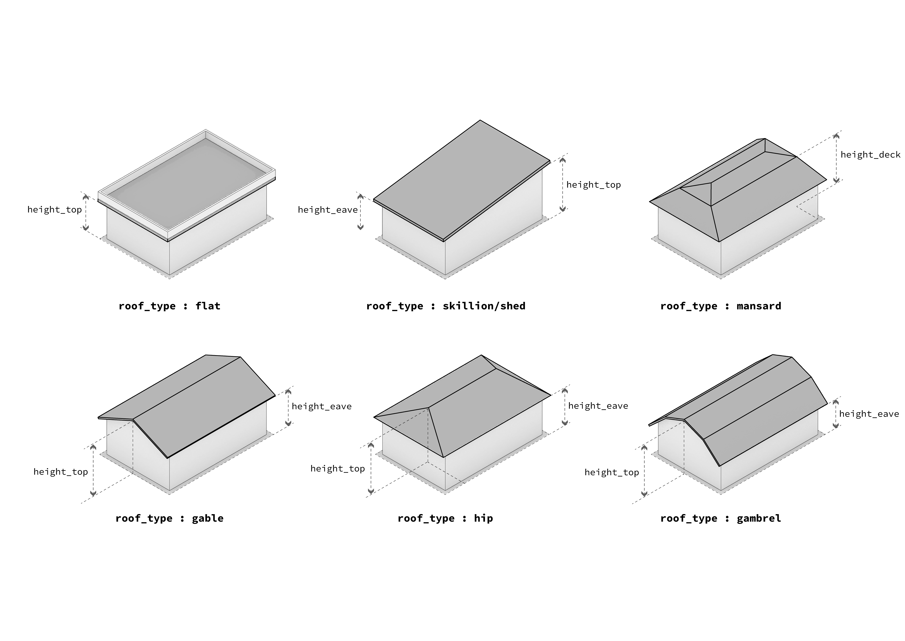

# Appendix C

The `roof_type` variable in the OZFS \*.bldg file can take any of the
following values:

- `"flat"`: A flat roof with the same height across the entire
  structure.

- `"shed"`: A roof without a ridge that is higher on one side than the
  other.

- `"mansard"`: A roof with two slopes on each of four sides.

- `"hip"`: A roof with one slope on each of four sides.

- `"gable"`: A roof with one slope on each of two opposite sides.

- `"gambrel"`: A roof with two slopes on each of two opposite sides.

- `"barrel"`: A roof with arcs on each of two opposite sides.
- `"dome"`: A dome-shaped roof.

NOTE: Add barrel and dome shapes to figure.

Figure 1

The table below indicate which roof height variables must be defined for
each of the above roof types.

| Roof type | `height_top` | `height_plate` | `height_eave` | `height_deck` |
|-----------|:------------:|:--------------:|:-------------:|:-------------:|
| `flat`    |      x       |       x        |               |               |
| `shed`    |      x       |       x        |       x       |               |
| `mansard` |      x       |       x        |       x       |       x       |
| `hip`     |      x       |       x        |       x       |               |
| `gable`   |      x       |       x        |       x       |               |
| `gambrel` |      x       |       x        |       x       |               |
| `barrel`  |      x       |       x        |       x       |               |
